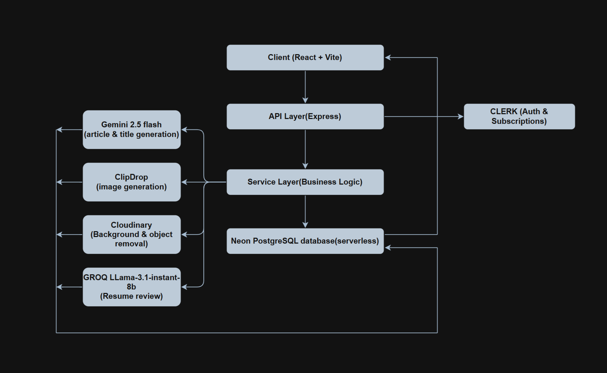
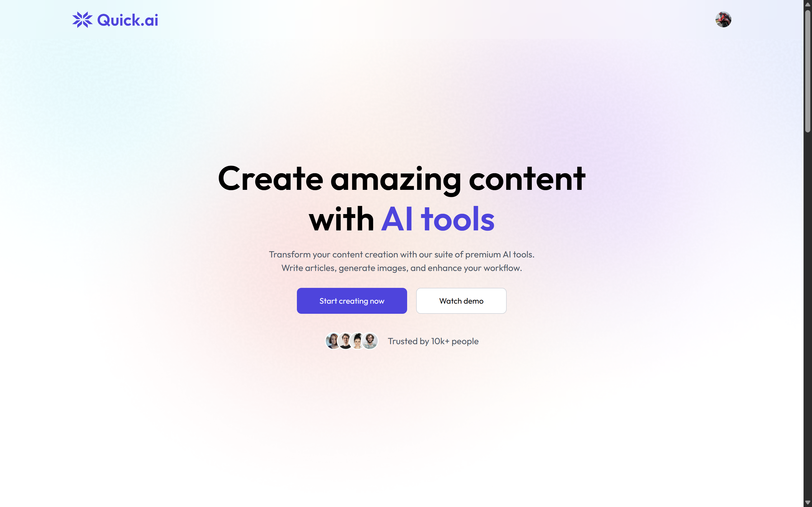
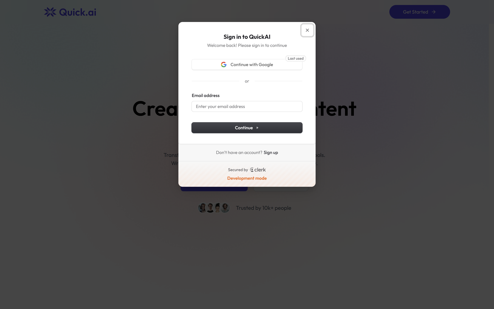
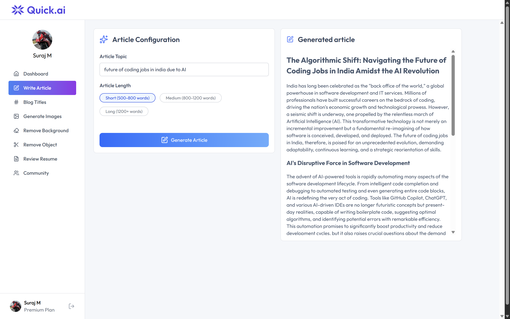
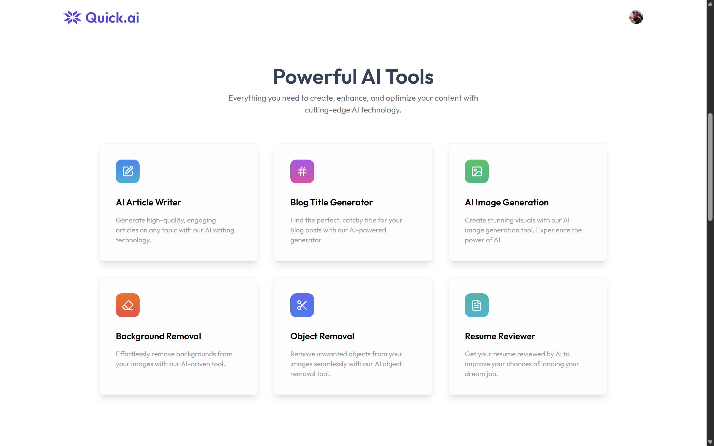
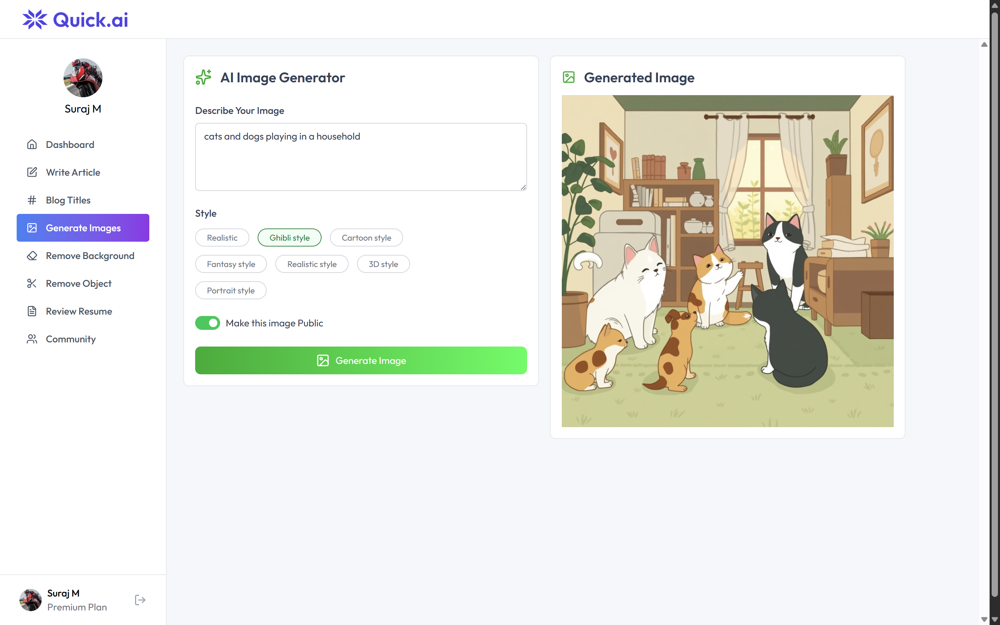
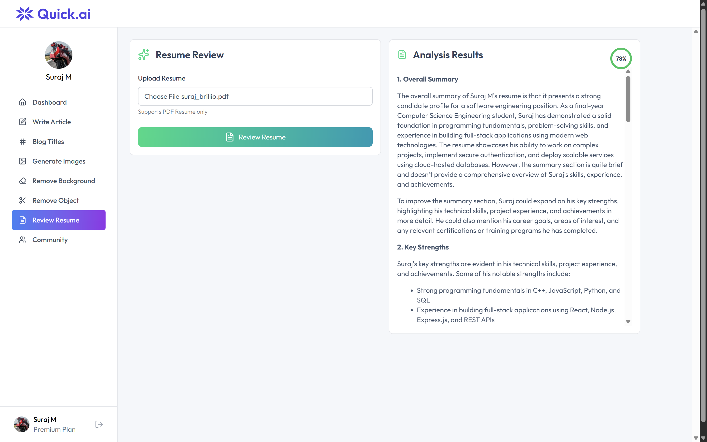

# 🚀 QuickAI – AI-Powered SaaS Platform

QuickAI is a **production-ready AI SaaS application** that brings together content generation, image processing, and resume analysis into a single scalable platform.  
It is built with a **real-world product mindset**, focusing on clean architecture, scalability, and secure AI integration.

🌐 **Live Demo:** https://quick-ai-psi-gray.vercel.app/

---

## 🧠 What is QuickAI?

QuickAI enables users to:
- Generate **AI-powered articles & blog titles**
- Perform **image background & object removal**
- Analyze resumes using a **custom ATS scoring system**
- Explore a **community feed** of AI-generated content
- Manage usage, subscriptions, and history via a dashboard

This project is built end-to-end as a **real SaaS product**, not a clone.

---

## 🧩 System Architecture

  

### Architecture Overview
- **Frontend:** React + Vite handles UI and user interaction
- **Backend:** Express APIs manage business logic and orchestration
- **Service Layer:** Abstracts multiple AI providers
- **Database:** Serverless PostgreSQL (Neon) stores users, usage, and results
- **Auth & Billing:** Clerk handles authentication and subscriptions
- **Media:** Cloudinary optimizes and serves images

All AI outputs are processed server-side, **stored in the database**, and then returned to the frontend for consistency and scalability.

---

## 🛠️ Tech Stack

### Frontend

### Backend

### Database

### AI & Cloud

### Auth & Billing

---

## 🖼️ Project Screenshots

### 🔐 Authentication & Landing 

  
  

### 🧠 AI Content & Tools

  
  

### 🖼️ Image generation & 📄 Resume Analyzer (ATS)

  
   

---

## ⚙️ Key Engineering Highlights

- Multi-AI provider integration with clean abstraction
- Secure authentication and subscription-based access
- Usage-based limits to control AI costs
- Stateless backend with serverless database
- Production-ready SaaS architecture

---

## 👨‍💻 Author

**Suraj M**  
Final-Year Computer Science Student  
Full-Stack Developer | AI & SaaS Enthusiast  

---

⭐ *QuickAI demonstrates real-world system design, scalable architecture, and end-to-end product ownership.*
